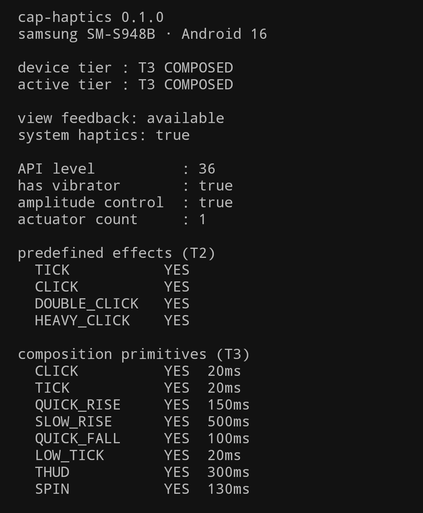
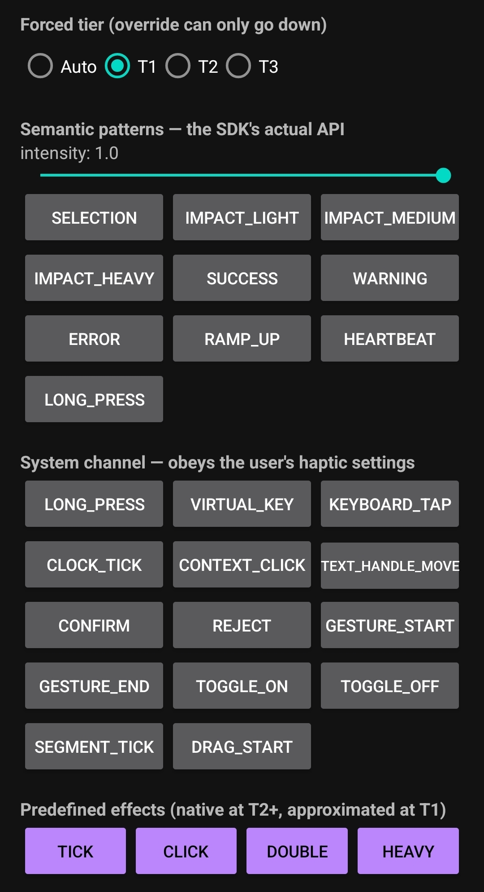
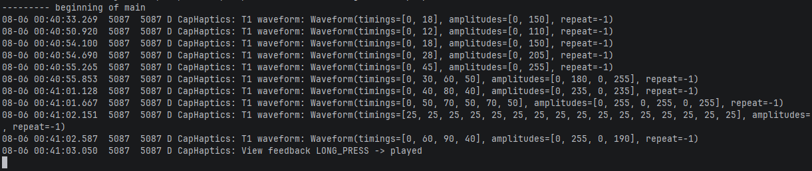

# cap-haptics-android

**The Android native engine of Cap Haptics — a semantic haptics SDK in Kotlin, driven
from Unity through a versioned JNI ABI.** The product hub (Unity project, UPM package,
demo app) is [`cap-haptics-unity`](https://github.com/WhaRang/cap-haptics-unity); this repo is the engineering
deep dive.


---

## Abstract

Most haptics code hardcodes an assumption about a motor it has never met. `vibrate(200)`
feels like a crisp tap on one phone, a dull smear on another, and nothing at all on a third.

cap-haptics inverts that. You ask for a **meaning** — `SUCCESS`, `IMPACT_HEAVY`, `SELECTION` —
and the library decides how to render it on the hardware actually in front of it: composing
tuned primitives on a modern LRA, falling back through platform-tuned effects to hand-authored
waveforms on weaker motors. Every pattern is guaranteed to produce *something* on every
supported device, and the choice is driven by **probed capability, never by API level alone**.

The Android SDK is complete and tested. A Unity C# layer — the `dev.wharang.caphaptics`
UPM package — sits on top of it through a JNI bridge with a versioned ABI, and a sibling
Swift implementation (`cap-haptics-ios`) renders the same semantic API through Core
Haptics on iPhone.

---

## Screenshots

| Capabilities & tier selection | Semantic patterns + tier override | Degradation in logcat |
|---|---|---|
|  |  |  |
| What the device can actually do, and which tier that lands it on | The SDK's real API, with the forced-tier switch used to feel the fallbacks | Per-primitive substitution and tier fallback, live |

---

## The problem this solves

Android's vibration APIs arrived in four waves, and each one is only *sometimes* available:

- Pre-26 — on/off buzzing only
- **26** — `VibrationEffect`, waveforms, amplitude control *(if the motor supports it)*
- **29** — platform-tuned predefined effects
- **30/31** — hardware-tuned composition primitives *(if the motor supports them)*

The trap: **version does not imply capability.** An API 31 phone with a cheap ERM motor reports
no primitive support at all. Gating on `Build.VERSION.SDK_INT` alone produces code that calls
APIs the device technically has and physically cannot honour.

cap-haptics probes the device once at init, picks a tier from what it *measured*, and renders
every pattern through that tier.

---

## Architecture

```
┌─ Unity (C#) ─────────────────────────────────────────────────────┐
│ L0  Public API        Haptics.Play(HapticPattern.Success)        │
│ L1  Platform router   Android / iOS / Editor stub                │
│ L2  JNI bridge        AndroidJavaObject, primitives only         │
└──────────────────────────┬───────────────────────────────────────┘
                           │  JNI  (the ABI — tiny, versioned, stable)
┌──────────────────────────┴───────────────────────────────────────┐
│ L3  Kotlin facade      :haptics-unity — JNI-safe, no-throw       │
├──────────────────────────────────────────────────────────────────┤
│ L4  Capability probe   what can this device actually do?         │
│ L5  Backend strategy   pick one of 3 tiers, once, at init        │
│ L6  Pattern registry   semantic pattern → per-tier rendering     │
│                                                    :haptics-core │
└───────────────── Android Vibrator / VibratorManager ─────────────┘
```

### Gradle modules

| Module | What it is |
|---|---|
| `:haptics-core` | The SDK. Never mentions Unity — a plain Android library any app could consume. |
| `:haptics-unity` | A pure JNI adapter. Primitives, JSON, no-throw wrappers, nothing else. |
| `:app` | A native harness for tuning patterns by feel without Unity in the loop. |

The harness exists because the Unity build cycle is far too slow for the dozens of iterations
that tuning a haptic pattern actually takes.

---

## The three tiers

Selected **once at init**, from probed capability — not per call.

| Tier | Gate | Mechanism |
|---|---|---|
| **T3 — Composed** | API 30+ *and* `arePrimitivesSupported` confirms the core primitives | `VibrationEffect.Composition` — crisp, hardware-tuned |
| **T2 — Predefined** | API 29+ | `createPredefined` — OEM-tuned constants |
| **T1 — Waveform** | any device with a motor (the floor) | API 26+: `createWaveform`, amplitude if the motor has it; API 21–25: the legacy timing-pattern `vibrate`, rhythm only |

There's also a parallel **system channel** (`View.performHapticFeedback`) used only for genuine
UI gestures. It's the one path that obeys the user's haptic settings *and reports when it was
suppressed* — the `Vibrator` path silently does nothing instead.

### Degradation matrix (excerpt)

Every pattern declares a rendering at every tier. A test asserts the matrix has no holes.

| Pattern | T3 | T2 | T1 |
|---|---|---|---|
| `SELECTION` | `TICK` @0.6 | `EFFECT_TICK` | 12 ms @ 110 |
| `IMPACT_HEAVY` | `CLICK` @1.0 | `EFFECT_HEAVY_CLICK` | 45 ms @ 255 |
| `SUCCESS` | `QUICK_RISE` @0.7 → `CLICK` @1.0 | *(waveform)* | `[0,30,60,50]` @ `[0,180,0,255]` |
| `HEARTBEAT` | `THUD` @1.0 → `THUD` @0.75 | *(waveform)* | `[0,60,90,40]` @ `[0,255,0,190]` |
| `RAMP_UP` | `SLOW_RISE` @1.0 | *(waveform)* | 16-step swell, 60→255 |

---

## Design decisions worth reading

Things that turned out to be less obvious than expected:

**Substitution is per-primitive, not per-pattern.** A motor may render `CLICK` perfectly and
refuse `THUD`. Dropping a whole composition to a lower tier over one garnish primitive throws
away the crispness of every other step, so each primitive resolves through an ordered chain
that terminates in the two the T3 gate already guarantees.

**T2 cannot sequence.** The predefined API plays one effect per `vibrate` call. Two beats would
mean scheduling from a `Handler`, and system load between them smears the rhythm — so
multi-beat patterns render as a single waveform even at T2. T2's advantage over T1 is OEM
tuning of *individual impacts*; it has nothing to offer a rhythm.

**Intensity scaling is perceptual, not linear.** Motors have a floor below which nothing is
felt, and sensation is compressive. A plain multiply doesn't fade — it falls off a cliff and
the bottom half of the dial is dead travel. Intensity maps onto `[floor, 1]` through a
compressive curve, and can only ever *reduce* the authored rendering.

**Nothing in the public API throws.** An exception unwinding through JNI into a game engine is
a native crash, and a haptic effect is never worth crashing over. Every call returns a result
code; a fuzz suite hammers the pure layers with `Long.MIN_VALUE` timings, `NaN` intensities and
malformed arrays.

**The ABI is versioned and self-describing.** The bridge exposes `getBridgeVersion()` and a
manifest of every enum's wire id, which C# validates at init. A stale AAR reports exactly
what's wrong instead of throwing `NoSuchMethodError` from somewhere unhelpful.

---

## Testing without the hardware

There's one test device, and it's a modern flagship that always lands on T3 — so the
interesting code, the fallbacks, can never be reached naturally. Two things make them
verifiable anyway:

1. **`CapabilityProbe` is the only class that touches the platform.** Everything downstream —
   tier selection, the pattern registry, intensity scaling, primitive substitution — is a pure
   function over a `HapticCapabilities` data class. "What happens on an API 22 device with no
   amplitude control" is a JVM unit test, not a device you have to buy.
2. **A forced-tier override**, so every tier can be *felt* on one phone. It simulates the code
   path, not the hardware — a forced T1 tells you what the waveform backend emits, not how that
   would feel through a 2018 ERM motor.

A side effect worth keeping: because the model layer must stay free of `android.*`, and
`android.util.Log` is a throwing stub under JVM tests, **the test suite enforces the layering**.
`testOptions.unitTests.isReturnDefaultValues` is deliberately *not* enabled — the failure is the
feature.

---

## Building

Requires JDK 25 (Android Studio's bundled JBR works).

```bash
# Everything: compile, lint, unit tests
./gradlew build

# Install the native tuning harness on a connected device
./gradlew :app:installDebug

# Build both AARs and copy them into the Unity project
./gradlew installUnityPlugin
```

The install destination defaults to
`../cap-haptics-unity/Packages/dev.wharang.caphaptics/Plugins/Android` and is
overridable with `-PcapHaptics.unityPluginDir=…`.

Two AARs ship, not one: an AAR doesn't bundle its transitive dependencies, so `haptics-core`
travels alongside `haptics-unity`.

## Using it

```kotlin
Haptics.initialize(activity)
Haptics.playPattern(HapticPattern.SUCCESS)
Haptics.playPattern(HapticPattern.IMPACT_LIGHT, intensity = 0.6f)
```

`VIBRATE` is declared in the library's own manifest and merges automatically — consumers never
need to know it exists.

---

## Repository layout

```
cap-haptics/
├── cap-haptics-android/     Kotlin SDK (this repo)
│   ├── haptics-core/        the library
│   ├── haptics-unity/       JNI adapter
│   └── app/                 native tuning harness
├── cap-haptics-ios/         Swift plugin — the same semantic API on Core Haptics
└── cap-haptics-unity/       Unity 6 project + the published UPM package
```

## License

MIT
